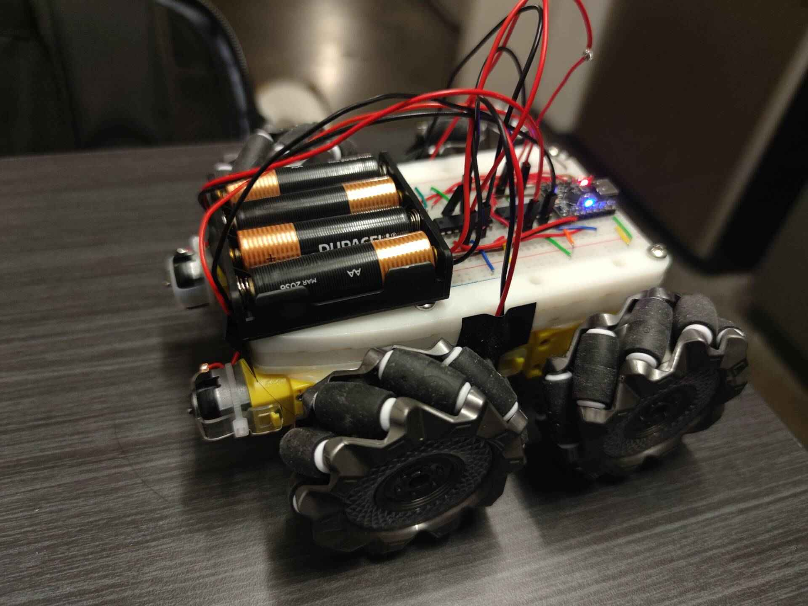
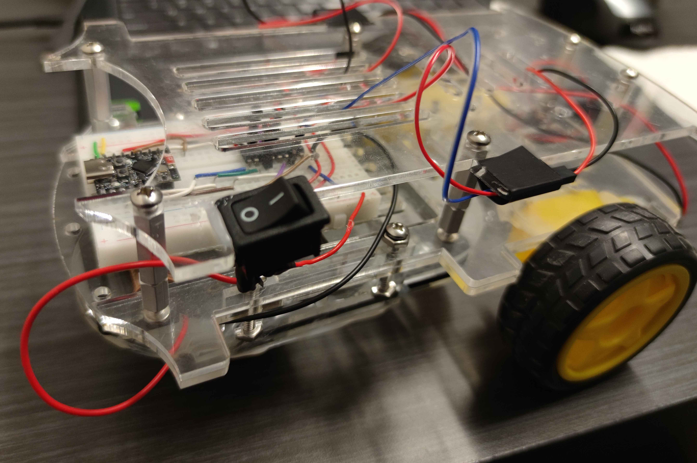
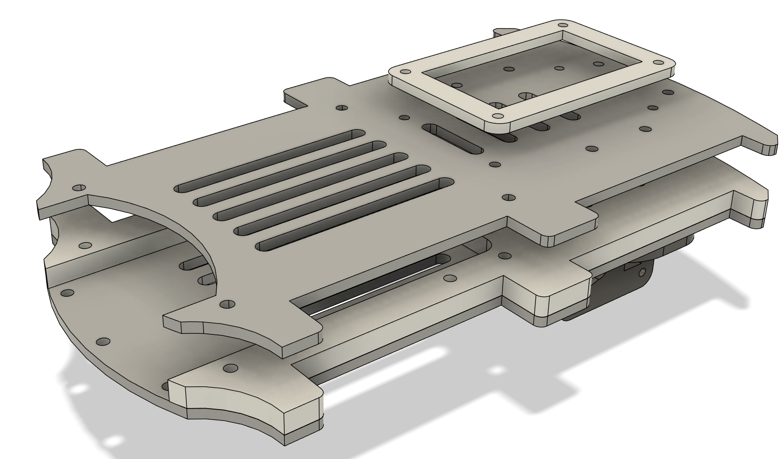
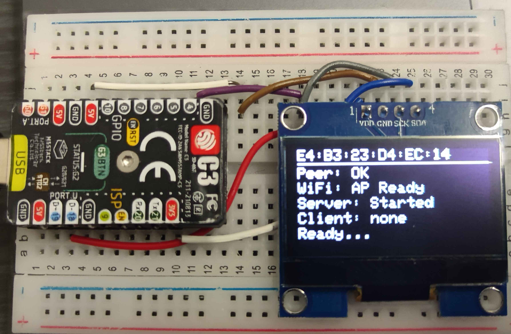
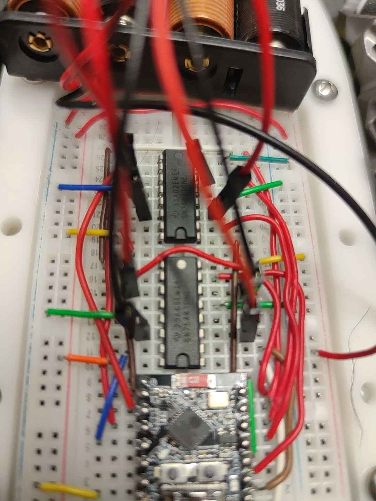
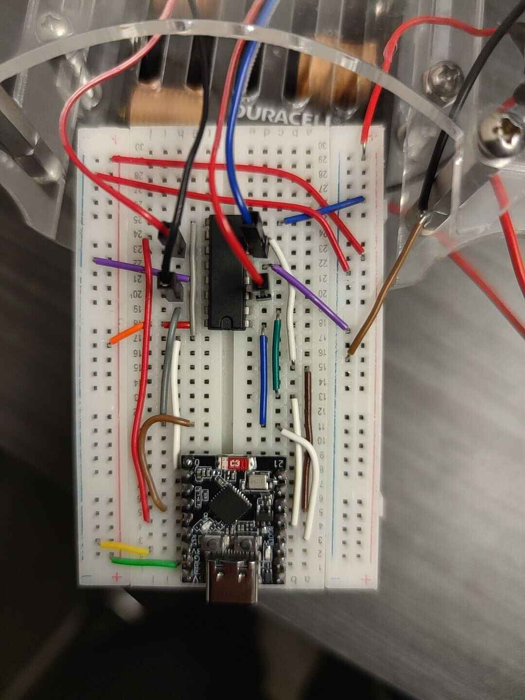

# ESP32 RC Car

[](https://www.arduino.cc/)
[](https://www.espressif.com/)
[](https://www.espressif.com/en/products/modules/esp32)
[](https://www.espressif.com/en/products/software/esp-now/overview)

> A browser-based RC car project powered by ESP32-C3, featuring real-time control through an intuitive web interface with virtual joystick controls. Available in both single-board and dual-board configurations.

---

## Features

### Core Features
- Dual operation modes: Default (2-wheel) and Omni (4-wheel) drive
- Mode switching via hardware switch
- Browser-based control interface with virtual joystick
- Real-time motor control and status monitoring
- ESP-NOW communication for reliable control
- Emergency stop function
- Individual wheel speed tuning

### Communication Options
- Single-board WiFi mode
  - Direct WiFi AP connection
  - Browser-based control
  - Low latency for close range
- Dual-board ESP-NOW mode
  - Extended range (100m+)
  - More reliable connection
  - No WiFi network required
  - Split control/drive functionality

## Setup Guide

### Option 1: Single ESP32 Setup (Simpler)
1. Choose your desired mode and flash the corresponding code:
   - For Default mode: Flash `default/default.ino`
   - For Omni mode: Flash `omni/omni.ino`
2. Wire motors according to pin configuration
3. Power up the system
4. Connect to WiFi AP "Web RC Car"
5. Navigate to `192.168.1.101` in browser

### Option 2: Dual ESP32 Setup (Advanced)
Requires two ESP32 boards - one for control, one for the car.

#### Controller Options:
A. Basic Controller:
   - Flash `control.ino` to controller ESP32
   - Simple setup, fixed control mode

B. Advanced Controller (with mode switching):
   - Flash `master_control.ino` to controller ESP32
   - Requires additional wiring:
     * Mode switch to PIN 5
     * OLED display (SDA: 3, SCL: 4)
   - Allows real-time mode switching

#### Car Setup (Required for both controller options):
1. Flash `drive.ino` to car's ESP32
2. Wire motors according to pin config
3. Configure MAC addresses:
   - Set receiving MAC in drive board
   - Set corresponding MAC in controller

#### Usage:
1. Power up both boards
2. Connect to controller's WiFi:
   - Basic: "Web RC Car"
   - Advanced: "RC Default Mode" or "RC Omni Mode"
3. Navigate to `192.168.1.101`
4. If using advanced controller, use switch to toggle modes

### Mode Selection (Dual ESP Setup)
- Default Mode (2-wheel): Switch LOW
  - Standard differential steering
  - Forward/reverse with turning
- Omni Mode (4-wheel): Switch HIGH
  - Full directional control
  - Rotation while moving

## Architecture

### Single-Board Version
```
┌─────────────┐     ┌──────────────┐     ┌───────────┐
│  Browser    │ WS  │   ESP32-C3   │ PWM │   Motors  │
│  Interface  │◄───►│  Web Server  │────►│   Driver  │
└─────────────┘     └──────────────┘     └───────────┘
```

### Dual-Board Version
```
┌─────────────┐     ┌──────────────┐     ┌──────────────┐     ┌───────────┐
│  Browser    │ WS  │   Control    │     │    Drive     │ PWM │   Motors  │
│  Interface  │◄───►│    Board     │◄───►│    Board     │────►│   Driver  │
└─────────────┘     └──────────────┘     └──────────────┘     └───────────┘
                          WiFi              ESP-NOW
```

### Component Overview

1. **Web Interface** (`web_interface.cpp`)
    - HTML/CSS layout
    - JavaScript joystick controls
    - WebSocket client
    - Real-time status display
    - UI event handling

2. **Control Board** (`control.ino`)
    - Web server hosting
    - User interface handling
    - ESP-NOW transmitter
    - OLED display updates
    - Connection management

3. **Drive Board** (`drive.ino`)
    - ESP-NOW receiver
    - Motor control logic
    - Failsafe handling
    - Automatic reconnection
    - Status monitoring

### Communication Flow
```
Browser (Web Interface) → WebSocket → Control Board → ESP-NOW → Drive Board → Motors
```

### Data Flow
```
User Input → JSON Command → ESP-NOW Packet → Motor Signal → Physical Movement
```

## Master Controller

<table>
<tr>
<td width="50%">
The file <code>master_control.ino</code> manages both Omni and Default modes
through ESP-NOW communication. Default mode now also supports direct
ESP-NOW control to the drive board.
</td>
<td width="50%">

</td>
</tr>
</table>

## Hardware Requirements

- ESP32-C3-Mini development board
- Dual H-Bridge motor driver
- 2x / 4x DC motors with wheels 
- LiPo battery or AA batteries
- Chassis (3D printed, Laser Cut parts, etc)
- Basic electronic components
- Soldering is optional

## Vehicle Builds

<table>
<tr>
<td width="50%">

### Omni-Drive Version

*4-wheel omni-directional drive configuration*

</td>
<td width="50%">

### Standard Version

*2-wheel differential drive configuration*

</td>
</tr>
</table>

## Pin Configuration

### Default Version (2-Wheel Drive)
| Pin | Function |
|-----|----------|
| 7   | Left Motor PWM |
| 0   | Right Motor PWM |
| 8   | Left Motor Forward |
| 9   | Left Motor Reverse |
| 4   | Right Motor Forward |
| 3   | Right Motor Reverse |

### Omni Version (4-Wheel Drive)
| Motor          | Enable Pin (PWM) | Direction 1 | Direction 2 |
|----------------|------------------|-------------|-------------|
| Left Front     | 5               | 6           | 7           |
| Right Front    | 20              | 21          | 3           |
| Left Back      | 8               | 9           | 10          |
| Right Back     | 2               | 1           | 0           |

## Dual-Board Version

An alternative version using two ESP32 boards with ESP-NOW communication:

### Features
- Long-range control (hundreds of meters)
- Direct peer-to-peer communication
- No WiFi network required
- Split control and drive functionality
- More reliable communication

### Components
- Control Board: Handles web interface and user input
- Drive Board: Controls motors and receives commands
- ESP-NOW protocol for board-to-board communication

### Benefits
- Separation of concerns
- Extended range capability
- Reduced latency
- More reliable motor control
- Independent WiFi and control systems

The code for this version is in:
- `control.ino`: Web interface and ESP-NOW transmitter
- `drive.ino`: Motor control and ESP-NOW receiver

## Web Interface

The interface includes:
- Interactive joystick
- Real-time wheel speed indicators
- Quick control buttons
- Fine-tuning controls
- Status monitoring panel

## Supporting Documentation

### Design Files

*3D CAD model of chassis*

### Control Display

*OLED status display on control board*

### Wiring Diagrams

*Omni version wiring*


*Default version wiring*

## Technical Details

### Motor Control
- 10-bit PWM resolution (0-1023)
- 50Hz PWM frequency
- Minimum PWM threshold for reliable start
- Individual wheel speed tuning
- Proportional turn control

### Network Configuration
- AP Mode: `Web RC Car`
- IP: 192.168.1.101
- No password required
- Optimized for low latency

## Performance Tuning

1. **Motor Dead Zone**: Adjust `MOTOR_MIN_PWM` if motors don't start smoothly
2. **Turn Sensitivity**: Modify the turn rate mapping in the web interface
3. **Wheel Balance**: Use the tuning sliders to compensate for motor differences
