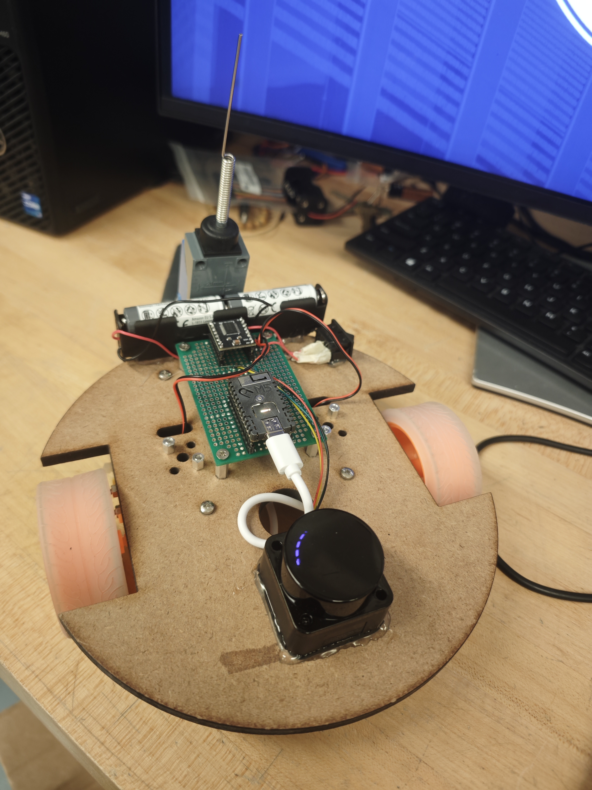
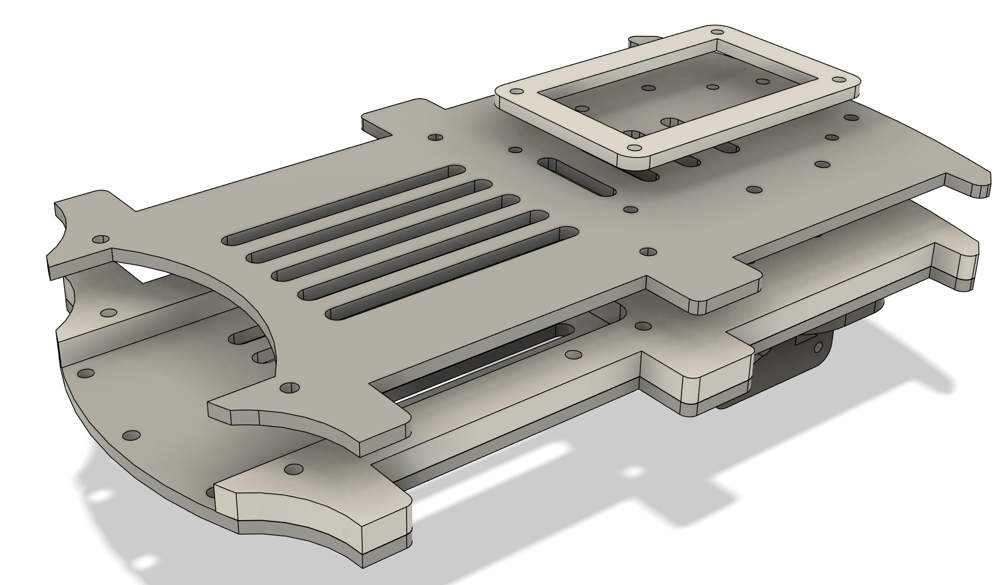

# ESP32 RC Car

[](https://www.arduino.cc/)
[](https://www.espressif.com/)
[](https://www.espressif.com/en/products/software/esp-now/overview)

---

## V2 — LiDAR Bot

<table>
<tr>
<td width="50%">

<em>Robot driving while mapping its surroundings with the LD06 LiDAR</em>
</td>
<td width="50%">

<em>V2 LiDAR Bot</em>
</td>
</tr>
</table>

A simple ESP32 RC car anyone can build. Two TT motors, a TB6612FNG motor driver, and an LD06 LiDAR. Two modes: **manual drive** and **basic wander**.

### Hardware

**Required:**
- ESP32-C3
- TB6612FNG dual motor driver
- 2x TT motors
- 5V USB power bank (ESP32) + AA battery pack (motors, 6V VM)

**Optional:**
- LD06 LiDAR
- IMU
- Motor encoders

### Modes

| Key | Mode |
|-----|------|
| `1` | Manual drive (teleop via controller) |
| `4` | Basic wander — LiDAR obstacle avoidance |
| `x` | Stop |

In basic wander mode the bot drives forward, scans all sectors with the LD06, and avoids walls with reverse-and-spin escapes. The stuck detector triggers an unstuck maneuver if the bot stops making progress.

### Wiring — Bot

| LD06 | ESP32-C3 |
|------|----------|
| TX   | GPIO 0   |
| RX   | GPIO 1   |
| GND  | GND      |

| TB6612FNG | ESP32-C3 |
|-----------|----------|
| PWMA      | GPIO 4   |
| AIN1      | GPIO 6   |
| AIN2      | GPIO 5   |
| BIN1      | GPIO 7   |
| BIN2      | GPIO 8   |
| PWMB      | GPIO 10  |
| STBY      | tie HIGH |

### Flashing

Flash each sketch to its board:

- `v2/Bot/Bot.ino` → bot ESP32-C3
- `v2/Controller/Controller.ino` → controller ESP32-C3

Set `kBotMac` in `Controller.ino` to match the bot's MAC address (printed on boot via serial).

### Controller (ESP-NOW + USB)

The controller bridges your PC to the bot over ESP-NOW. Plug the **controller** into USB and run either host tool.

**Serial commands (460800 baud):**

| Key | Action |
|-----|--------|
| `1` | Manual mode |
| `4` | Autonomous mode |
| `x` | Stop |
| `w s a d q e` | Drive in manual mode |
| `Lf200` / `Rb150` / `Ls` | Direct motor command |

### Host Tools (`v2/py_scripts/`)

Two Python tools — plug into the **controller** board.

**Install:**
```bash
pip install viser pyserial numpy
```

**Lidar viewer:**
```bash
cd v2/py_scripts
python -m lidar --port COMx --baud 460800
```
Open `http://localhost:8080` for a live point cloud.

**Teleop with viewer:**
```bash
cd v2/py_scripts
python -m teleop --port COMx --baud 460800
```

Replace `COMx` with the controller's port (e.g. `COM5` on Windows, `/dev/ttyUSB0` on Linux).

### Data Flow

```
PC → Controller (USB serial) → ESP-NOW → Bot → motors
Bot → ESP-NOW → Controller → USB serial → host viewer
```

---

## V1 — ESP32-C3 RC Car



The original browser-based RC car. Supports 2-wheel differential and 4-wheel omni drive, single-board WiFi or dual-board ESP-NOW. All code is in [`v1/`](v1/).

See the V1 source folders for setup details:
- `v1/default/` — single-board builds for ESP32-C3, C3-mini, and generic ESP32
- `v1/omni/` — omni-directional drive builds
- `v1/master_control/` — dual-board master controller with OLED and mode switch
- `v1/joystick_control/` — physical joystick controller
- `v1/mac_reader/` — utility to read ESP32 MAC address
